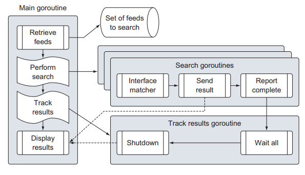

# Golang Search Engine
This is a silly little demo app to learn Golang.

## Explanation of the program
The program
pulls different data feeds from the web and compares the content against a
search term. The content that matches is then displayed in the terminal window

The program reads text files, makes web calls, and decodes both XML and JSON into
struct type values, and it does all of this using Go concurrency to make things fast

#### Architecture



#### Execution

```go
func main() {
	var searchTerm = "Angola"
	search.Run(searchTerm)
}
```

```
2017/09/27 19:54:23 Search Feed Type[rss] Site[npr] For URI[http://www.npr.org/rss/rss.php?id=1001]
2017/09/27 19:54:23 Register default matcher
2017/09/27 19:54:23 Search Feed Type[rss] Site[npr] For URI[http://www.npr.org/rss/rss.php?id=1008]
2017/09/27 19:54:23 Register rss matcher
2017/09/27 19:54:23 Search Feed Type[rss] Site[npr] For URI[http://www.npr.org/rss/rss.php?id=1006]
2017/09/27 19:54:23 Search Feed Type[rss] Site[npr] For URI[http://www.npr.org/rss/rss.php?id=1007]
2017/09/27 19:54:23 Search Feed Type[rss] Site[npr] For URI[http://www.npr.org/rss/rss.php?id=1057]
2017/09/27 19:54:23 Search Feed Type[rss] Site[npr] For URI[http://www.npr.org/rss/rss.php?id=1021]
2017/09/27 19:54:23 Search Feed Type[rss] Site[npr] For URI[http://www.npr.org/rss/rss.php?id=1012]
2017/09/27 19:54:23 Search Feed Type[rss] Site[npr] For URI[http://www.npr.org/rss/rss.php?id=1003]
2017/09/27 19:54:23 Search Feed Type[rss] Site[npr] For URI[http://www.npr.org/rss/rss.php?id=2]
2017/09/27 19:54:23 Search Feed Type[rss] Site[npr] For URI[http://www.npr.org/rss/rss.php?id=3]
2017/09/27 19:54:23 Search Feed Type[rss] Site[npr] For URI[http://www.npr.org/rss/rss.php?id=5]
2017/09/27 19:54:23 Search Feed Type[rss] Site[npr] For URI[http://www.npr.org/rss/rss.php?id=13]
2017/09/27 19:54:23 Search Feed Type[rss] Site[npr] For URI[http://www.npr.org/rss/rss.php?id=46]
2017/09/27 19:54:23 Search Feed Type[rss] Site[npr] For URI[http://www.npr.org/rss/rss.php?id=7]
2017/09/27 19:54:23 Search Feed Type[rss] Site[npr] For URI[http://www.npr.org/rss/rss.php?id=10]
2017/09/27 19:54:23 Search Feed Type[rss] Site[npr] For URI[http://www.npr.org/rss/rss.php?id=39]
2017/09/27 19:54:23 Search Feed Type[rss] Site[npr] For URI[http://www.npr.org/rss/rss.php?id=43]
2017/09/27 19:54:23 Search Feed Type[rss] Site[bbci] For URI[http://feeds.bbci.co.uk/news/rss.xml]
2017/09/27 19:54:23 Search Feed Type[rss] Site[bbci] For URI[http://feeds.bbci.co.uk/news/business/rss.xml]
2017/09/27 19:54:23 Search Feed Type[rss] Site[bbci] For URI[http://feeds.bbci.co.uk/news/world/us_and_canada/rss.xml]
2017/09/27 19:54:23 Search Feed Type[rss] Site[cnn] For URI[http://rss.cnn.com/rss/cnn_topstories.rss]
2017/09/27 19:54:23 Search Feed Type[rss] Site[foxnews] For URI[http://feeds.foxnews.com/foxnews/national?format=xml]
2017/09/27 19:54:23 Search Feed Type[rss] Site[foxnews] For URI[http://feeds.foxnews.com/foxnews/politics?format=xml]
2017/09/27 19:54:23 Search Feed Type[rss] Site[nbcnews] For URI[http://rss.msnbc.msn.com/id/21491571/device/rss/rss.xml]
2017/09/27 19:54:23 Search Feed Type[rss] Site[nbcnews] For URI[http://feeds.nbcnews.com/feeds/topstories]
2017/09/27 19:54:23 Search Feed Type[rss] Site[cnn] For URI[http://rss.cnn.com/rss/cnn_world.rss]
2017/09/27 19:54:23 Search Feed Type[rss] Site[nbcnews] For URI[http://feeds.nbcnews.com/feeds/usnews]
2017/09/27 19:54:23 Search Feed Type[rss] Site[cnn] For URI[http://rss.cnn.com/rss/cnn_us.rss]
2017/09/27 19:54:23 Search Feed Type[rss] Site[foxnews] For URI[http://feeds.foxnews.com/foxnews/world?format=xml]
2017/09/27 19:54:23 Search Feed Type[rss] Site[nbcnews] For URI[http://rss.msnbc.msn.com/id/21491043/device/rss/rss.xml]
2017/09/27 19:54:23 Search Feed Type[rss] Site[cnn] For URI[http://rss.cnn.com/rss/cnn_allpolitics.rss]
2017/09/27 19:54:23 Search Feed Type[rss] Site[cnn] For URI[http://rss.cnn.com/rss/cnn_crime.rss]
2017/09/27 19:54:23 Search Feed Type[rss] Site[nbcnews] For URI[http://rss.msnbc.msn.com/id/28180066/device/rss/rss.xml]
2017/09/27 19:54:23 Search Feed Type[rss] Site[cnn] For URI[http://rss.cnn.com/rss/cnn_tech.rss]
2017/09/27 19:54:23 Search Feed Type[rss] Site[foxnews] For URI[http://feeds.foxnews.com/foxnews/opinion?format=xml]
2017/09/27 19:54:23 Search Feed Type[rss] Site[cnn] For URI[http://rss.cnn.com/rss/cnn_health.rss]
2017/09/27 19:54:23 Search Feed Type[rss] Site[foxnews] For URI[http://rss.cnn.com/rss/cnn_topstories.rss]
2017/09/27 19:54:24 Title:
Angola Swears In First New President In 38 Years

2017/09/27 19:54:24 Description:
For the first time in 38 years, Angola has someone other than José Eduardo dos Santos as its president. João Lourenço faces a challenge to bring change in a country struggling with an oil-dominated economy.
```